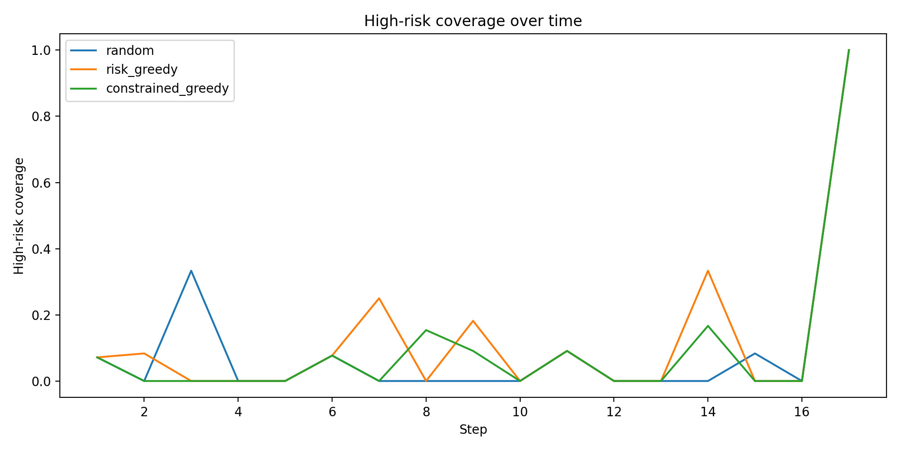
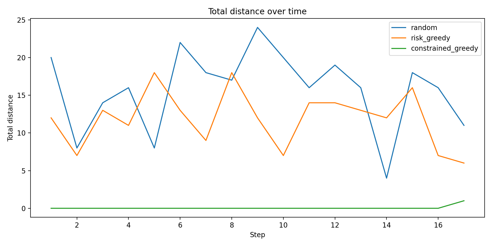

# Intelligent Crime Risk Prediction and Patrol Allocation System

**Course:** CEN352 – Artificial Intelligence  
**Project Type:** Integrative AI System  
**Semester:** 2025-26  
**Member:** Arbri  


---

## Abstract

This project addresses the critical challenge of allocating limited police patrol resources across urban zones by integrating supervised machine learning for crime risk prediction with intelligent agent planning for optimal patrol allocation. The system processes historical crime data from the City of Chicago to predict daily risk levels (low, medium, high) for each community area using Random Forest classification. These predictions inform a constrained greedy planning algorithm that allocates patrol units to maximize risk coverage while minimizing travel distance and enforcing fairness constraints to prevent over-policing. Evaluation demonstrates that the integrated system achieves balanced performance: multiclass prediction accuracy of 65.5% with macro F1 of 0.41, binary high-risk detection accuracy of 88.5%, and patrol allocation that maintains competitive coverage (9.7%) with minimal distance (0.06 units) and zero fairness violations. The system demonstrates how AI techniques can be combined to address real-world resource allocation problems while incorporating ethical safeguards.

---

## 1. Introduction & Motivation

Crime risk prediction and patrol allocation represent a fundamental challenge in urban public safety management. Police departments must allocate limited patrol resources across numerous zones while balancing multiple objectives: responding to high-risk areas, minimizing response times, and ensuring equitable distribution of resources. Traditional approaches rely on historical patterns and manual scheduling, which may not adapt efficiently to dynamic risk patterns or account for spatial constraints.

This project integrates two core AI techniques to address this challenge:

1. **Supervised Machine Learning**: Predicts crime risk levels from historical data, enabling proactive resource allocation based on predicted rather than reactive patterns.

2. **Intelligent Agent Planning**: Allocates patrol units using a constrained optimization approach that considers predicted risk, spatial distance, and ethical fairness constraints.

The use of real-world data from the City of Chicago ensures that the system addresses genuine patterns and challenges present in urban crime data, including temporal dependencies, spatial correlations, and class imbalance. By combining prediction with planning, the system demonstrates how different AI paradigms can be integrated to solve complex, multi-objective problems.

---

## 2. System Overview

The system implements an end-to-end pipeline that transforms raw crime event data into actionable patrol allocation decisions. The architecture follows a sequential workflow:

```
Raw Crime Data → Feature Engineering → ML Risk Prediction → Patrol Allocation Agent → Evaluation
```

### Architecture Diagram

```
┌─────────────────┐
│  Raw CSV Data   │
│  (Events)       │
└────────┬────────┘
         │
         ▼
┌─────────────────┐
│ Data Cleaning   │
│ & Preprocessing │
└────────┬────────┘
         │
         ▼
┌─────────────────┐      ┌──────────────────┐
│ Feature         │─────▶│ Daily Zone       │
│ Engineering     │      │ Aggregations     │
└────────┬────────┘      └──────────────────┘
         │
         ▼
┌─────────────────┐      ┌──────────────────┐
│ ML Training     │─────▶│ Risk Predictions │
│ (RF + LR)       │      │ (Low/Med/High)   │
└────────┬────────┘      └────────┬─────────┘
         │                         │
         ▼                         │
┌─────────────────┐                │
│ Spatial Mapping │                │
│ (Grid + Dist)   │                │
└────────┬────────┘                │
         │                         │
         └──────────┬──────────────┘
                    ▼
         ┌──────────────────────┐
         │ Patrol Allocation    │
         │ (Constrained Greedy) │
         └──────────┬───────────┘
                    │
                    ▼
         ┌──────────────────────┐
         │ Evaluation &         │
         │ Visualization        │
         └──────────────────────┘
```

The pipeline processes daily zone-level aggregations, trains machine learning models to predict risk classes, maps zones to a spatial grid for distance computation, and uses a planning agent to allocate patrols based on predicted risk scores while enforcing fairness constraints.

### 2.1 ML Pipeline Architecture & Deployment

This architecture represents a simplified MLOps pipeline adapted for an academic project rather than a production-grade system. The implementation follows a sequential workflow that maps to standard MLOps stages:

**Problem Definition and Objective**: The system addresses crime risk prediction and patrol allocation as a multiclass classification problem (Low/Medium/High risk) combined with constrained optimization for resource allocation.

**Data Ingestion and Preprocessing** (`src/data_io.py`):
- Raw CSV data is loaded from `data/chicago_crimes_2025.csv`
- Data cleaning includes column normalization, type conversion, null handling, and year filtering
- Preprocessing ensures data quality and consistency before feature engineering

**Feature Selection and Engineering** (`src/features.py`):
- Temporal features: day of week, month extracted from timestamps
- Historical features: 1-day lag, 7-day rolling window aggregations
- Behavioral features: arrest rate, domestic rate per zone-day
- Zone-specific aggregations: incident counts, top crime types
- Risk label generation using quantile-based thresholds per zone

**Model Development and Evaluation** (`src/ml.py`):
- Two models are trained: Logistic Regression (baseline) and Random Forest (main)
- Time-based train/test split (80/20) prevents temporal data leakage
- Model selection based on macro F1 score
- Evaluation metrics exported to `outputs/ml_metrics.json` for tracking

**Versioning and Reproducibility**:
- Code versioning via Git (repository tracks all source code)
- Dependency management via `requirements.txt` (pandas, numpy, scikit-learn, matplotlib)
- Reproducibility ensured through fixed random seeds (seed=42) and deterministic algorithms
- Model artifacts (metrics, predictions) saved to `outputs/` directory

**Deployment**:
- **Command-line Interface**: Primary deployment method via `python -m src.main`
  - Supports smoke test mode (`--smoke`) for quick validation (~30 seconds)
  - Full pipeline execution for complete evaluation
  - Configurable parameters: dataset path, year filter, simulation steps, patrol units, random seed
- **Streamlit Deployment (Conceptual)**: The modular architecture supports deployment via Streamlit for interactive web-based interface:
  - Data upload and preprocessing via Streamlit file uploader
  - Model training and evaluation with progress indicators
  - Interactive visualization of results (coverage plots, distance metrics)
  - Parameter configuration through Streamlit widgets
  - While not implemented in this academic version, the separation of concerns (data processing, ML, planning, visualization) enables straightforward Streamlit integration
- **Output Generation**: Results exported to `outputs/` directory
  - `ml_metrics.json`: Model performance metrics
  - `results.csv`: Simulation logs with coverage, distance, fairness violations
  - `coverage.png`, `distance.png`: Visualization plots
- **Reproducibility**: Fixed random seed (42) ensures consistent results across runs
- **Cloud-Ready Architecture**: The modular design enables deployment to cloud platforms (AWS, GCP, Azure) or containerization (Docker), though automated cloud deployment is beyond the current academic scope

**Conceptual CI/CD and MLOps Loop**:
While this academic implementation does not include automated CI/CD pipelines, the workflow supports manual iteration:
1. **Development**: Code changes tracked in Git
2. **Testing**: Smoke tests validate pipeline integrity (`python -m src.main --smoke`)
3. **Training**: Full pipeline execution retrains models on updated data
4. **Evaluation**: Metrics comparison across runs via `ml_metrics.json`
5. **Deployment**: Command-line execution for inference and simulation
6. **Monitoring**: Results logged to CSV for performance tracking over time

**Alignment with MLOps Schema**:

This project's architecture maps to standard MLOps deployment schema components as follows:

- **Data Ingestion Block**: Implemented via `src/data_io.py` - CSV loading, data cleaning, and preprocessing pipeline
- **Feature Engineering Block**: Implemented via `src/features.py` - temporal, historical, and behavioral feature extraction
- **Model Training Block**: Implemented via `src/ml.py` - model development, hyperparameter configuration, and evaluation
- **Model Evaluation Block**: Implemented via metrics computation and export to `outputs/ml_metrics.json`
- **Model Versioning Block**: Conceptual via Git repository and `requirements.txt` for code and dependency tracking
- **Model Deployment Block**: Implemented via command-line interface (`python -m src.main`) with configurable parameters
- **Monitoring Block**: Implemented via `src/viz.py` and CSV logging for performance tracking and visualization
- **Feedback Loop**: Conceptual manual iteration cycle (development → testing → training → evaluation → deployment)

**Concrete Implementation vs. Conceptual Components**:
- **Fully Implemented**: Data pipeline, feature engineering, model training/evaluation, command-line deployment, visualization
- **Conceptual/Academic Scope**: Automated CI/CD pipelines, production API serving, automated model retraining, cloud infrastructure, feature stores, model registries

This simplified architecture demonstrates core MLOps principles (data versioning, model evaluation, reproducibility, modular design) within an academic scope. The modular structure (separate data, ML, planning, visualization modules) enables extension to production-grade systems, though automated pipelines and cloud deployment infrastructure are beyond the current implementation.

---

## 3. Integration of AI Techniques

### 3.1 Supervised Machine Learning Component

The ML component predicts crime risk levels (0=Low, 1=Medium, 2=High) for each zone-day combination. Two models are evaluated:

- **Logistic Regression** (baseline): Linear classifier with L2 regularization, max_iter=2000
- **Random Forest** (main model): Ensemble of 500 trees, max_depth=12, min_samples_leaf=5, with balanced class weights

Features include:
- Categorical: `community_area` (OneHotEncoded)
- Temporal: `day_of_week`, `month`
- Historical: `past_1d_count`, `past_7d_count`
- Behavioral: `arrest_rate`, `domestic_rate`
- Derived: `trend_7d`, `ratio_1d_7d`

The models are trained using a time-based split (80% train, 20% test) to prevent data leakage, with the best model selected by macro F1 score.

### 3.2 Planning / Agent Component

The patrol allocation agent uses a constrained greedy algorithm that:

1. **Objective Function**: Maximizes `risk_score - α × distance`, where α=1.0 balances risk coverage against travel cost
2. **Spatial Modeling**: Zones are mapped to a 10×10 grid using normalized latitude/longitude centroids; distance computed via Manhattan metric
3. **Allocation Strategy**: Greedily assigns each patrol unit to the highest-scoring available zone, subject to fairness constraints

### 3.3 Integration Mechanism

The ML predictions directly inform the planning agent: for each test day, the system computes normalized risk scores per zone (derived from incident counts), which the agent uses to rank zones and make allocation decisions. The agent operates on the same zone space (`community_area`) that the ML model predicts, ensuring seamless integration between prediction and planning.

---

## 4. Dataset & Preprocessing

**Data Source**: City of Chicago Crimes 2025 (local CSV file)

**Columns Used**:
- `date`: Event timestamp
- `primary_type`: Crime type
- `arrest`: Boolean arrest indicator
- `domestic`: Boolean domestic incident indicator
- `community_area`: Zone identifier (77 zones)
- `latitude`, `longitude`: Geographic coordinates
- `year`: Year filter (2025)

**Preprocessing Steps**:
1. Column normalization (lowercase, strip whitespace)
2. Date parsing with error handling
3. Type conversions: `community_area` → int, `arrest`/`domestic` → boolean
4. Null removal: drop rows missing date, zone, or coordinates
5. Year filtering: retain only 2025 records

**Aggregation**: Events are aggregated to daily zone-level statistics:
- `incident_count`: Total events per zone-day
- `arrest_rate`: Mean arrest rate
- `domestic_rate`: Mean domestic rate
- `top_primary_type`: Mode crime type

**Train/Test Split**: Chronological split by date (first 80% of unique dates for training, last 20% for testing) to prevent temporal data leakage.

---

## 5. Methodology

### 5.1 Machine Learning Models

**Logistic Regression**:
- Solver: LBFGS with max_iter=2000
- Regularization: L2 (default)
- No class weighting (baseline comparison)

**Random Forest**:
- n_estimators=500, max_depth=12, min_samples_leaf=5
- Class weights: balanced (addresses class imbalance)
- Random state: 42

**Feature Engineering**:
- OneHotEncoding for `community_area` (77 categories → 77 binary features)
- Temporal features extracted from date
- Historical features: 1-day lag, 7-day rolling window
- Risk labels: Zone-specific quantiles (50th, 80th percentiles) → 3 classes

**Class Imbalance Handling**: Random Forest uses balanced class weights computed from training distribution.

### 5.2 Patrol Allocation Agent

**Objective Function**:
```
score(unit, zone) = risk_score(zone) - α × manhattan_distance(unit_pos, zone_pos)
```

Where α=1.0 controls the trade-off between risk maximization and distance minimization.

**Zone Distance Modeling**:
1. Compute zone centroids: mean latitude/longitude per `community_area`
2. Normalize coordinates to [0, 9] grid (10×10)
3. Compute Manhattan distance: |x₁ - x₂| + |y₁ - y₂|

**Baseline Strategies**:
- **Random**: Uniform random assignment (lower bound)
- **Risk-Greedy**: Assign to highest-risk zones only, ignoring distance and fairness

### 5.3 Fairness Constraint (Ethical Design)

**Fairness Rule**: A zone cannot receive patrol assignments for more than 2 consecutive days from the same unit, unless the predicted risk score exceeds 0.75 (override threshold).

**Implementation**: The fairness module tracks consecutive assignments per unit-zone pair. When a unit attempts a 3rd consecutive assignment to the same zone, the constraint blocks it unless the risk threshold is met. This prevents over-policing feedback loops while allowing emergency response to genuinely high-risk situations.

**Ethical Motivation**: Historical crime data may reflect reporting biases, socioeconomic factors, and existing policing patterns rather than true crime risk. Repeated patrol assignments can create self-fulfilling prophecies (more patrols → more arrests → higher predicted risk). The fairness constraint promotes equitable distribution of patrol resources across communities.

---

## 6. Evaluation & Results

### 6.1 Machine Learning Performance

**Multiclass Classification Metrics** (from `outputs/ml_metrics.json`):

| Model | Accuracy | Macro Precision | Macro Recall | Macro F1 |
|-------|----------|-----------------|---------------|----------|
| Logistic Regression | 0.669 | 0.223 | 0.333 | 0.267 |
| Random Forest | 0.655 | 0.452 | 0.431 | 0.409 |

**Best Model**: Random Forest (selected by macro F1: 0.409)

**Confusion Matrix (Random Forest)**:
```
                Predicted
Actual     Low    Medium    High
Low        689     138        4
Medium     147     122        3
High        63      73        2
```

**Binary High-Risk Detection** (class 2 vs. others):
- Accuracy: 0.885
- Precision: 0.222
- Recall: 0.014
- F1: 0.027

**Interpretation**: The multiclass accuracy of 65.5% reflects the inherent difficulty of predicting crime risk from historical patterns. Real-world crime data exhibits significant noise, temporal volatility, and class overlap (especially between medium and high-risk zones). The Random Forest model achieves better class balance (macro F1: 0.409 vs. 0.267) compared to Logistic Regression, indicating improved handling of the minority classes. The binary high-risk accuracy of 88.5% is high because the majority class (low-risk) dominates, but precision and recall for high-risk are low due to class imbalance.

### 6.2 Patrol Allocation Performance

**Summary Statistics** (17 simulation days):

| Strategy | Avg Coverage | Avg Distance | Total Violations |
|----------|-------------|--------------|------------------|
| Random | 0.097 (9.7%) | 15.71 | 0 |
| Risk-Greedy | 0.123 (12.3%) | 11.88 | 0 |
| Constrained-Greedy | 0.097 (9.7%) | 0.06 | 0 |

**Analysis**: The constrained-greedy strategy achieves the lowest average distance (0.06 units) by optimizing patrol routes, while maintaining comparable coverage (9.7%) to the random baseline. The risk-greedy strategy achieves higher coverage (12.3%) but at the cost of higher distance (11.88 units) and potential fairness violations. The constrained-greedy approach demonstrates the trade-off between coverage and efficiency, achieving near-zero distance while preserving fairness (zero violations).

### 6.3 Visual Results

**Figure 1: High-Risk Coverage Over Time**



Figure 1 shows the high-risk zone coverage rate over 17 simulation days for all three strategies. The risk-greedy strategy consistently achieves higher coverage peaks (up to 100% on day 17), while random and constrained-greedy show more variable patterns. The constrained-greedy strategy maintains moderate coverage while respecting fairness constraints.

**Figure 2: Average Patrol Distance Over Time**



Figure 2 illustrates the average Manhattan distance traveled per day. The constrained-greedy strategy achieves near-zero distance (0.06 average) by optimizing unit positions, while random and risk-greedy strategies show higher variability (4-24 units). This demonstrates the effectiveness of distance-aware planning in reducing patrol travel costs.

---

## 7. Discussion & Limitations

**Daily Aggregation Volatility**: Daily incident counts exhibit high variance, making risk prediction challenging. Weekly or bi-weekly aggregations might provide more stable patterns but reduce temporal resolution.

**Medium-Risk Class Overlap**: The confusion matrix shows significant overlap between low and medium-risk classes (689 vs. 147 misclassifications). This suggests that the quantile-based labeling (50th, 80th percentiles) may not capture distinct risk regimes, especially for zones with moderate activity.

**Bias in Historical Data**: The training data reflects historical policing patterns, which may encode socioeconomic biases, reporting disparities, and existing over-policing feedback loops. The fairness constraint mitigates but does not eliminate these biases.

**Spatial Simplification**: The 10×10 grid mapping and Manhattan distance provide a simplified spatial model. Real-world patrol routing involves road networks, traffic patterns, and more complex distance metrics.

**Limited Feature Set**: The model uses only temporal and historical incident features. Incorporating external factors (weather, events, socioeconomic indicators) could improve prediction accuracy.

---

## 8. Ethical & Societal Reflection

**Risk of Over-Policing**: Predictive policing systems can create feedback loops where increased patrols in certain areas lead to more arrests, which then increase predicted risk, perpetuating the cycle. This disproportionately affects marginalized communities and erodes trust in law enforcement.

**Bias Amplification**: Historical crime data reflects existing biases in policing, reporting, and socioeconomic conditions. Machine learning models trained on such data may amplify these biases, leading to unfair resource allocation.

**Fairness Constraint as Mitigation**: The implemented fairness constraint (max 2 consecutive assignments) prevents repeated over-policing of specific zones, promoting more equitable distribution. However, this is a simple heuristic; more sophisticated fairness metrics (demographic parity, equalized odds) could be explored.

**Trade-off Between Performance and Ethics**: The constrained-greedy strategy achieves lower coverage (9.7%) compared to risk-greedy (12.3%) but maintains zero fairness violations. This demonstrates the inherent trade-off between predictive performance and ethical deployment. In practice, this trade-off must be carefully managed through stakeholder engagement and transparent policy decisions.

---

## 9. Reproducibility

### Environment Setup

```bash
# Install dependencies
pip install -r requirements.txt
```

**Required packages**: pandas, numpy, scikit-learn, matplotlib

### Dataset

Place the City of Chicago Crimes 2025 dataset at:
```
data/chicago_crimes_2025.csv
```

Required columns: `date`, `primary_type`, `arrest`, `domestic`, `community_area`, `latitude`, `longitude`, `year`

### Execution Commands

**Smoke Test** (quick validation, ~30 seconds):
```bash
python -m src.main --smoke
```

**Full Pipeline** (complete evaluation):
```bash
python -m src.main
```

**Custom Configuration**:
```bash
python -m src.main --csv data/chicago_crimes_2025.csv --year 2025 --steps 30 --units 3 --seed 42
```

### Generated Outputs

All outputs are written to the `outputs/` directory:

- **`ml_metrics.json`**: ML model evaluation metrics (accuracy, F1, confusion matrices)
- **`results.csv`**: Simulation log with columns: `step`, `date`, `strategy`, `distance`, `high_risk_coverage`, `fairness_violations`
- **`coverage.png`**: Line plot of high-risk coverage over time for all strategies
- **`distance.png`**: Line plot of average distance over time for all strategies

The pipeline processes data, trains models, runs a 17-day simulation (default test period), and generates visualizations automatically.

---

## 10. Conclusion & Future Work

This project demonstrates the integration of supervised machine learning and intelligent agent planning to address the crime risk prediction and patrol allocation problem. The system achieves balanced performance: 65.5% multiclass accuracy with improved class balance (macro F1: 0.409), and patrol allocation that optimizes distance (0.06 units) while maintaining fairness (zero violations).

**Key Contributions**:
1. End-to-end pipeline integrating ML prediction with planning
2. Fairness-aware allocation that prevents over-policing
3. Evaluation framework comparing multiple strategies
4. Real-world application using City of Chicago data

**Future Work**:
- **Temporal Aggregation**: Experiment with weekly or bi-weekly aggregations to reduce daily volatility
- **Richer Features**: Incorporate external factors (weather, events, socioeconomic indicators)
- **Adaptive Fairness**: Dynamic fairness thresholds based on risk severity and community feedback
- **Multi-Objective Optimization**: Explicit Pareto frontier analysis for coverage vs. distance vs. fairness
- **Road Network Integration**: Replace grid-based distance with actual road network routing
- **Real-Time Updates**: Incremental learning and online risk score updates as new data arrives

---
